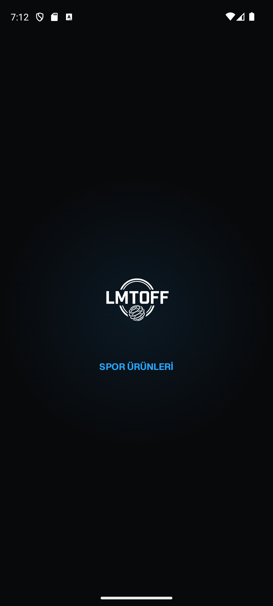
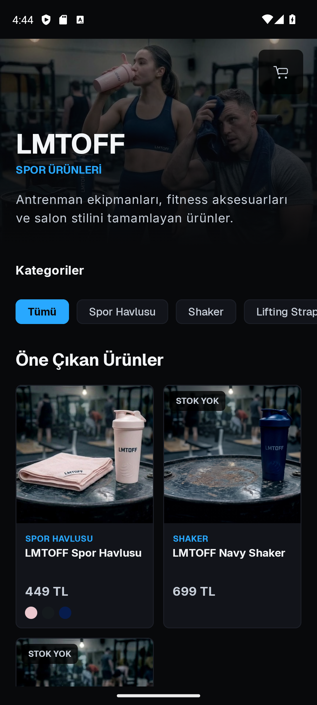
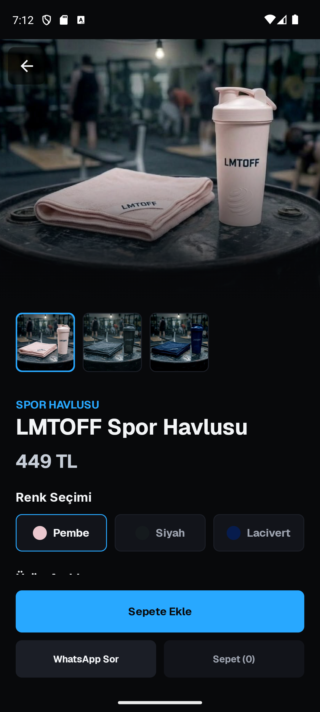
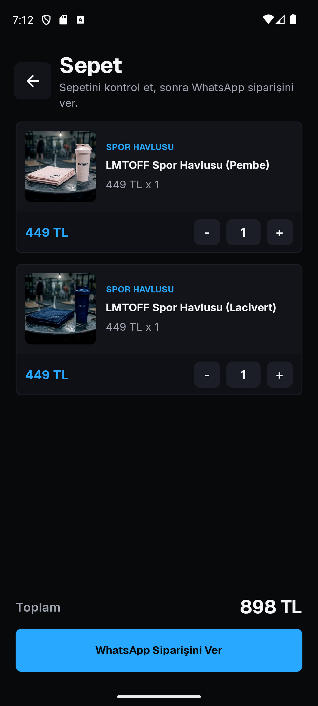

# LMTOFF Catalog

Jetpack Compose ile geliştirilmiş, tamamen koyu temalı bir spor ürünleri vitrini.
Ürünler kategoriye göre filtrelenir, renk seçenekleriyle sepete eklenir ve sipariş
hazır bir mesaj olarak WhatsApp üzerinden iletilir.

Proje, bir e-ticaret altyapısı kurmaktan çok **arayüz, tema ve hareket tasarımını**
Compose ile uçtan uca kurmaya odaklanır: özel tipografi ölçeği, marka renk paleti,
Canvas ile çizilen ikonlar ve animasyonlu açılış ekranı.

[](https://github.com/TunahanDilercan/lmtoff-catalog/actions/workflows/android.yml)


## Ekran Görüntüleri

| Açılış | Ana Ekran | Ürün Detayı | Sepet |
| --- | --- | --- | --- |
|  |  |  |  |

## Özellikler

- **Kategori filtresi** — ürünler kategoriye göre anında süzülür
- **Renk seçimi** — seçilen renk hem ürün görselini değiştirir hem de sepette ayrı satır olur
- **Sepet** — adet artırma/azaltma, satır bazlı ve toplam tutar
- **WhatsApp sipariş akışı** — sepet, biçimlendirilmiş bir sipariş mesajına çevrilip
  WhatsApp / WhatsApp Business / tarayıcı sırasıyla denenerek açılır
- **Stok durumu** — stokta olmayan ürün sepete eklenemez, arayüzde işaretlenir
- **Tasarım sistemi** — Geist + Inter font aileleri, tek noktadan yönetilen koyu renk paleti
- **Animasyonlu açılış** — logo üzerinde `rememberInfiniteTransition` ile nabız efekti

## Mimari

Tek Activity + Compose. Durum ekranların dışında, ViewModel'lerde tutulur; arayüz
katmanı veriye yalnızca `ProductRepository` arayüzü üzerinden erişir, böylece veri
kaynağı ileride uzak bir API ile değiştirilebilir ve iş mantığı Android bağımlılığı
olmadan test edilebilir.

```
MainActivity
└── LmtoffApp                 ← ekran geçişleri, ViewModel bağlantıları
    ├── SplashScreen
    ├── HomeScreen            ← CatalogViewModel (kategori filtresi, ürün listesi)
    ├── ProductDetailScreen   ← renk/galeri seçimi
    └── CartScreen            ← CartViewModel (sepet satırları, toplam)

data/  ProductRepository ← InMemoryProductRepository (sampleProducts)
util/  WhatsAppOrder     ← sepetten sipariş mesajı üretimi ve intent yönlendirmesi
```

Sepet mantığı (adet birleştirme, renge göre ayrı satır, toplam hesabı) ve sipariş
mesajı üretimi birim testleriyle doğrulanır.

## Kapsam Notu

Ürün verisi uygulama içinde sabittir (`data/SampleProducts.kt`) ve ödeme entegrasyonu
yoktur; sipariş WhatsApp'a yönlendirilir. Bu bilinçli bir kapsam tercihidir — bu repo
arayüz katmanına odaklanır. Ödeme sağlayıcısı ve backend içeren sürüm için:
[Clipix](https://github.com/TunahanDilercan/UrunList_Clipix).
